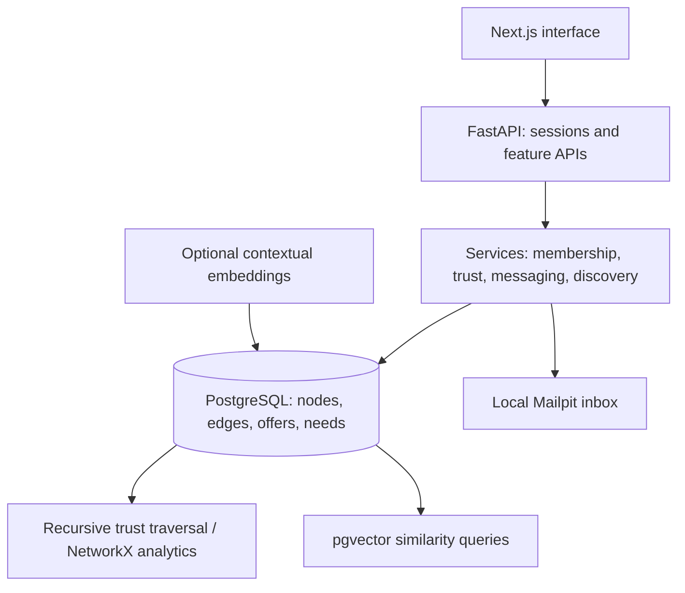

# Mycelium — community coordination through trust and shared needs

[](https://github.com/gitdataboxes/mycelium-demo/actions/workflows/checks.yml)

A full-stack prototype for connecting people, community groups, and events through what they offer, what they need, and who they know.

**Next.js + TypeScript · FastAPI + async SQLAlchemy · PostgreSQL + pgvector · NetworkX**

A neighbor offers bike repair. A community event needs a repair volunteer. Mycelium represents both as nodes with offers and needs, supports semantic matching, and uses relationship proximity to make discovery more relevant. First contact can happen through a group or event before becoming a direct conversation.

## Try the no-account preview

Requires Node.js 20.9+ and npm. No API keys, database, or email account are needed.

```bash
git clone https://github.com/gitdataboxes/mycelium-demo.git
cd mycelium-demo/frontend
npm ci
npm run demo
```

Open **http://localhost:3000**. The banner identifies the sample community. You enter as fictional member Alice; sample connections and scores are predefined, and changes reset on refresh. This preview demonstrates the interface, not live semantic inference or backend authorization.

### A two-minute tour

1. Open **My Profile** and edit an offer or need.
2. Open **Organizations** and inspect a group's members, offers, and needs.
3. Open **Events** and inspect an upcoming gathering.
4. Open **Messages** to see a conversation started in an event's context.
5. Open **Connections** and **My Network** to inspect sample matching and trust relationships.

## Run the database-backed demo

Requires Docker with Compose. This path runs real API handlers, PostgreSQL queries, migrations, session authentication, and a local email inbox. All published host ports bind to loopback.

```bash
docker compose up --build -d --wait
docker compose exec backend python seed_synthetic.py
```

Open **http://localhost:3000**, request a login link for **maya@example.com**, then open **http://localhost:8025** to read the message in Mailpit and follow its link. No real email is sent by the default configuration.

The seed provides 15 fictional members, groups, upcoming events, offers/needs, trust edges, messages, and illustrative match history. It refuses to add another fixture set when users already exist. Data persists in the demo's named Docker volume; `docker compose down` stops services while retaining it.

Embeddings are not generated by seeding. To experiment with real semantic matching, supply `VOYAGE_API_KEY` in a local `.env` using [.env.example](.env.example); new/edited attributes can then be embedded. Historical seed scores remain illustrative. Provider use sends profile context to Voyage AI and may incur charges.

## Architecture



| Engineering topic | Read the implementation |
| --- | --- |
| Shared entity model and typed relationships | [nodes](backend/app/models/node.py), [edges](backend/app/models/edge.py) |
| Graph-distance discovery with cycle/depth bounds | [discovery](backend/app/services/discovery.py) |
| Offer/need matching using vector similarity | [matching](backend/app/services/matching.py) |
| Vouch-gated entry and personal visibility rules | [trust](backend/app/services/trust.py) |
| Context-based first contact and blocking | [messaging](backend/app/services/message.py) |
| Community detection and centrality | [graph analytics](backend/app/services/graph_analytics.py) |
| API client with separate sample/real implementations | [frontend API](frontend/src/lib/api.ts) |
| Schema evolution and behavioral checks | [migrations](backend/alembic/versions), [tests](backend/tests) |

## Decisions and tradeoffs

- **One PostgreSQL database:** relational records, vectors, and bounded graph traversal share transactions and deployment. Large graphs and all-pairs matching would need query/index work and workload benchmarks.
- **Common nodes and edges:** people, groups, and events reuse offers/needs and relationship behaviors. Typed service rules keep those generic records meaningful.
- **Trust distance for discovery:** nearby relationships influence browsing without a global reputation score. This is a product design choice, not a validated measure of trustworthiness.
- **Semantic matching plus context:** wording can differ between an offer and a need. Similarity thresholds and relevance need human evaluation; a score is not a probability of success.
- **Separate sample preview:** visitors can inspect interactions quickly. Database-backed behavior must be tested through the full stack.

## Verification

```bash
cd frontend
npm ci
npm run typecheck
npm run build:demo
```

Backend tests require an isolated PostgreSQL database with the vector extension. [Verification notes](docs/VERIFICATION.md) document commands, CI coverage, and limitations. CI also applies migrations and exercises the seed in a separate database.

## Prototype boundaries

This is a sanitized personal portfolio project. The sample preview is ephemeral; the full stack persists data. Production traffic, multi-community isolation, abuse resistance, and matching relevance have not been certified. The manual digest/analytics routes are development controls; keep this demo local. No paid provider calls are necessary for the default tour.

See [the data model](docs/data-model.md) and [messaging design](docs/messaging.md) for deeper context. Related projects: [Mystic Horizon](https://github.com/gitdataboxes/mystic-horizon-demo) for conversational agents, and [Phone Agent](https://github.com/gitdataboxes/phone-agent-demo) for the earlier TypeScript voice architecture.
